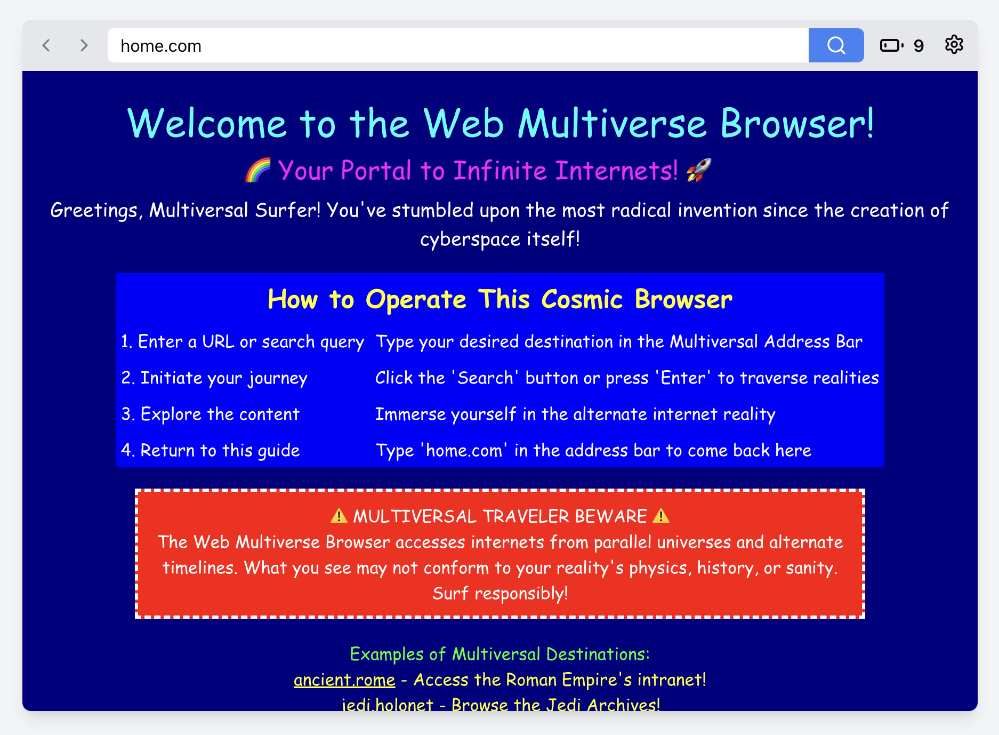
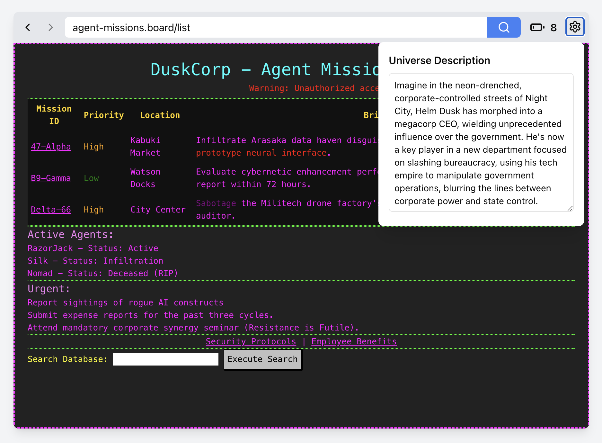
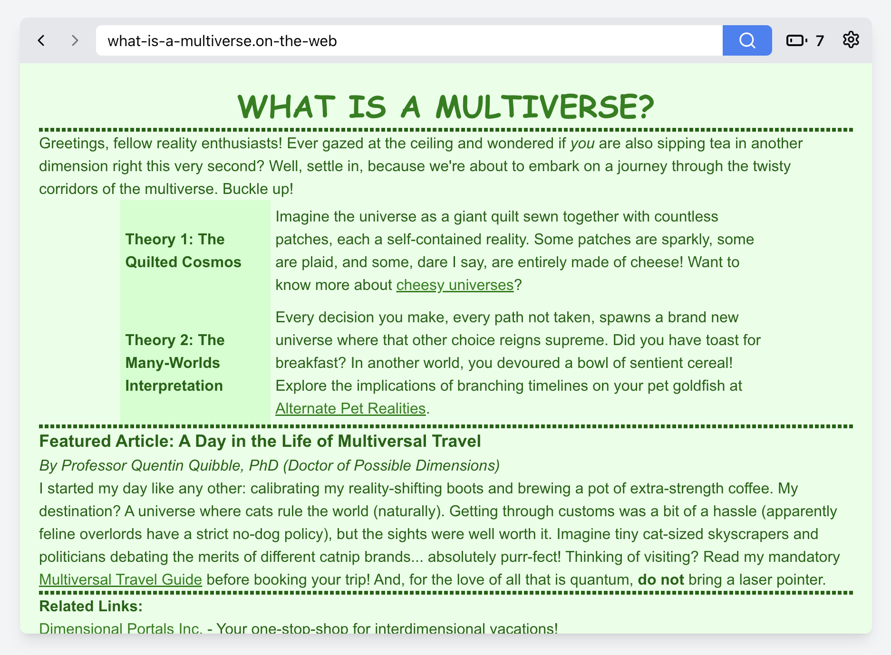

# Web Multiverse Browser

A fantasy web browser that generates AI-created webpages for an imaginary universe that you can customize. Explore alternate realities of the web through retro-styled pages complete with Comic Sans, marquees, and vibrant color schemes.

Web pages are generated with LLM based just on the URL and a universe description. You can follow the links to go deeper into the rabbit hole, as well as submit some forms and see where it brings you.

[Try on multiverse.pukhanov.ru](https://multiverse.pukhanov.ru)

## Screenshots





## Tech Stack

- [Next.js](https://nextjs.org/) with App Router
- [Vercel AI SDK](https://sdk.vercel.ai/) for streaming responses
- [OpenRouter](https://openrouter.ai/) as AI provider (Gemini 2.0 Flash)
- [Upstash](https://upstash.com/) Redis for rate limiting

## Setup

Copy the environment variables file and fill in your values:

```bash
cp .env.example .env
```

Required environment variables:

- \`OPENROUTER_API_KEY\`: OpenRouter API key
- \`KV_REST_API_URL\`: Upstash Redis REST URL
- \`KV_REST_API_TOKEN\`: Upstash Redis REST token

Run the development server:

```bash
npm run dev
```

Open [http://localhost:3000](http://localhost:3000) in your browser.
